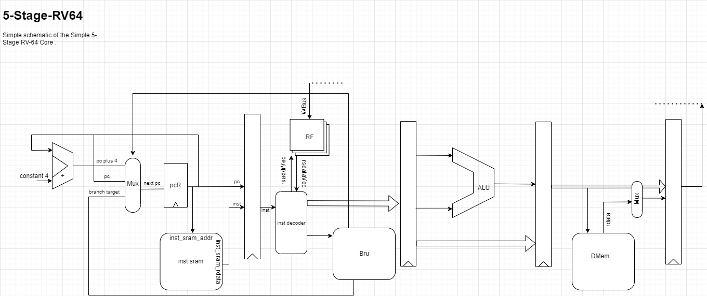

# MY NPC 

## 介绍
这是我的rv64 CPU ， 该项目使用verilator仿真器进行仿真，并根据ysyx使用nemu与am来进行模拟实现cpu。
其目录组成如下：

~~~shell
Mode                 LastWriteTime         Length Name

d-----          2022/5/6     22:10                build 		#生成的v文件
d-----         2022/5/13     22:49                doc
d-----         2022/5/13     22:23                obj_dir		#verilator生成的文件
d-----         2022/4/12     16:45                out
d-----         2022/4/12     16:20                playground		#chisel工作区
d-----         2022/5/13     22:18                src			#仿真环境与DUT
d-----          2022/5/1     21:32                test_run_dir
d-----         2022/5/13     20:32                wave			#波形文件
~~~

## 目前工作
* 五级流水线初步搭建成功 ，拥有阻塞控制,已完善支持I拓展指令。Verilator环境未实装支持loadstore的API。
* 已经接入AM ， NEMU结构正在重搭，还不支持差分测试

### 目前通过测试
* 已通过dummy。

## 目前结构

